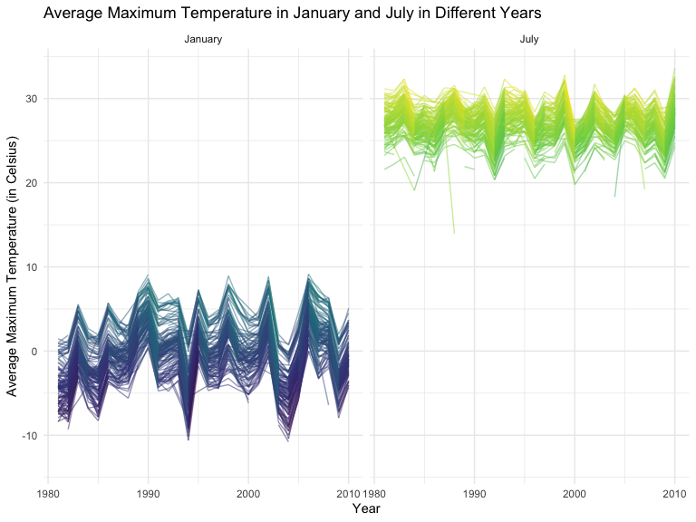
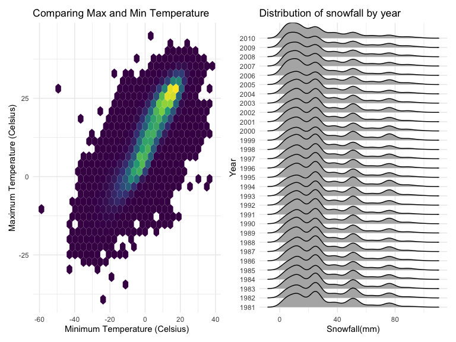

Homework 3 solutions
================
Hongji Jiang
2022-10-15

### Due date

Due: October 15 at 11:59pm.

### Points

| Problem         | Points    |
|:----------------|:----------|
| Problem 0       | 20        |
| Problem 1       | –         |
| Problem 2       | 40        |
| Problem 3       | 40        |
| Optional survey | No points |

### Problem 0

This solution focuses on a reproducible report containing code and text
necessary for Problems 1-3, and is organized as an R Project. This was
not prepared as a GitHub repo; examples for repository structure and git
commits should be familiar from other elements of the course.

Throughout, we use appropriate text to describe our code and results,
and use clear styling to ensure code is readable.

### Problem 1

#### Read in the data

``` r
data("instacart")

instacart = 
  instacart %>% 
  as_tibble(instacart)
```

#### Answer questions about the data

This dataset contains 1384617 rows and 15 columns, with each row
resprenting a single product from an instacart order. Variables include
identifiers for user, order, and product; the order in which each
product was added to the cart. There are several order-level variables,
describing the day and time of the order, and number of days since prior
order. Then there are several item-specific variables, describing the
product name (e.g. Yogurt, Avocado), department (e.g. dairy and eggs,
produce), and aisle (e.g. yogurt, fresh fruits), and whether the item
has been ordered by this user in the past. In total, there are 39123
products found in 131209 orders from 131209 distinct users.

Below is a table summarizing the number of items ordered from aisle. In
total, there are 134 aisles, with fresh vegetables and fresh fruits
holding the most items ordered by far.

``` r
instacart %>% 
  count(aisle) %>% 
  arrange(desc(n))
```

    ## # A tibble: 134 × 2
    ##    aisle                              n
    ##    <chr>                          <int>
    ##  1 fresh vegetables              150609
    ##  2 fresh fruits                  150473
    ##  3 packaged vegetables fruits     78493
    ##  4 yogurt                         55240
    ##  5 packaged cheese                41699
    ##  6 water seltzer sparkling water  36617
    ##  7 milk                           32644
    ##  8 chips pretzels                 31269
    ##  9 soy lactosefree                26240
    ## 10 bread                          23635
    ## # … with 124 more rows

Next is a plot that shows the number of items ordered in each aisle.
Here, aisles are ordered by ascending number of items.

``` r
instacart %>% 
  count(aisle) %>% 
  filter(n > 10000) %>% 
  mutate(aisle = fct_reorder(aisle, n)) %>% 
  ggplot(aes(x = aisle, y = n)) + 
  geom_point() + 
  labs(title = "Number of items ordered in each aisle") +
  theme(axis.text.x = element_text(angle = 60, hjust = 1))
```


Our next table shows the three most popular items in aisles
`baking ingredients`, `dog food care`, and `packaged vegetables fruits`,
and includes the number of times each item is ordered in your table.

``` r
instacart %>% 
  filter(aisle %in% c("baking ingredients", "dog food care", "packaged vegetables fruits")) %>%
  group_by(aisle) %>% 
  count(product_name) %>% 
  mutate(rank = min_rank(desc(n))) %>% 
  filter(rank < 4) %>% 
  arrange(desc(n)) %>%
  knitr::kable()
```

| aisle                      | product_name                                  |    n | rank |
|:---------------------------|:----------------------------------------------|-----:|-----:|
| packaged vegetables fruits | Organic Baby Spinach                          | 9784 |    1 |
| packaged vegetables fruits | Organic Raspberries                           | 5546 |    2 |
| packaged vegetables fruits | Organic Blueberries                           | 4966 |    3 |
| baking ingredients         | Light Brown Sugar                             |  499 |    1 |
| baking ingredients         | Pure Baking Soda                              |  387 |    2 |
| baking ingredients         | Cane Sugar                                    |  336 |    3 |
| dog food care              | Snack Sticks Chicken & Rice Recipe Dog Treats |   30 |    1 |
| dog food care              | Organix Chicken & Brown Rice Recipe           |   28 |    2 |
| dog food care              | Small Dog Biscuits                            |   26 |    3 |

Finally is a table showing the mean hour of the day at which Pink Lady
Apples and Coffee Ice Cream are ordered on each day of the week. This
table has been formatted in an untidy manner for human readers. Pink
Lady Apples are generally purchased slightly earlier in the day than
Coffee Ice Cream, with the exception of day 5.

``` r
instacart %>%
  filter(product_name %in% c("Pink Lady Apples", "Coffee Ice Cream")) %>%
  group_by(product_name, order_dow) %>%
  summarize(mean_hour = mean(order_hour_of_day)) %>%
  spread(key = order_dow, value = mean_hour) %>%
  knitr::kable(digits = 2)
```

    ## `summarise()` has grouped output by 'product_name'. You can override using the
    ## `.groups` argument.

| product_name     |     0 |     1 |     2 |     3 |     4 |     5 |     6 |
|:-----------------|------:|------:|------:|------:|------:|------:|------:|
| Coffee Ice Cream | 13.77 | 14.32 | 15.38 | 15.32 | 15.22 | 12.26 | 13.83 |
| Pink Lady Apples | 13.44 | 11.36 | 11.70 | 14.25 | 11.55 | 12.78 | 11.94 |

Import and clean the data. Create a weekday vs weekend variable \###
Problem 2

``` r
#import the data
accel_df = read_csv( "./accel_data.csv") %>%
#clean names
janitor::clean_names() %>%
#Create a variable weekend where weekend is TRUE if day is weekend
#And FALSE if day is not weekend
mutate(weekend = ifelse(day %in% c("Saturday", "Sunday"),FALSE,TRUE)) %>%
pivot_longer(
  activity_1:activity_1440,
  names_to = "minute",
  names_prefix = "activity_",
  values_to = "activity_numbers"
  ) %>%
  mutate(minute = as.numeric(minute))
```

    ## Rows: 35 Columns: 1443
    ## ── Column specification ────────────────────────────────────────────────────────
    ## Delimiter: ","
    ## chr    (1): day
    ## dbl (1442): week, day_id, activity.1, activity.2, activity.3, activity.4, ac...
    ## 
    ## ℹ Use `spec()` to retrieve the full column specification for this data.
    ## ℹ Specify the column types or set `show_col_types = FALSE` to quiet this message.

Aggregate across minutes to create a total activity variable for each
day and create a table. The order is changed to Monday to Sunday. No
apparent trend is observed. The sum of activity numbers is very low on
Saturdays of the 4th and 5th week.

``` r
accel_df %>%
        #change the order to monday to friday
        mutate(day = forcats::fct_relevel(day, c("Monday", "Tuesday", "Wednesday", "Thursday", "Friday", "Saturday", "Sunday"))) %>%
        group_by(week, day) %>%
        summarize(activity_numbers_sum = sum(activity_numbers)) %>%
        pivot_wider(names_from = "day",values_from = "activity_numbers_sum") %>%
        knitr::kable()
```

    ## `summarise()` has grouped output by 'week'. You can override using the
    ## `.groups` argument.

| week |    Monday |  Tuesday | Wednesday | Thursday |   Friday | Saturday | Sunday |
|-----:|----------:|---------:|----------:|---------:|---------:|---------:|-------:|
|    1 |  78828.07 | 307094.2 |    340115 | 355923.6 | 480542.6 |   376254 | 631105 |
|    2 | 295431.00 | 423245.0 |    440962 | 474048.0 | 568839.0 |   607175 | 422018 |
|    3 | 685910.00 | 381507.0 |    468869 | 371230.0 | 467420.0 |   382928 | 467052 |
|    4 | 409450.00 | 319568.0 |    434460 | 340291.0 | 154049.0 |     1440 | 260617 |
|    5 | 389080.00 | 367824.0 |    445366 | 549658.0 | 620860.0 |     1440 | 138421 |

``` r
accel_df %>%
        ggplot(aes(x=minute,y=activity_numbers,color=day)) +
        geom_line(alpha = 0.5)
```


``` r
library(p8105.datasets)
data("ny_noaa")
```

``` r
summary(ny_noaa)
```

    ##       id                 date                 prcp               snow       
    ##  Length:2595176     Min.   :1981-01-01   Min.   :    0.00   Min.   :  -13   
    ##  Class :character   1st Qu.:1988-11-29   1st Qu.:    0.00   1st Qu.:    0   
    ##  Mode  :character   Median :1997-01-21   Median :    0.00   Median :    0   
    ##                     Mean   :1997-01-01   Mean   :   29.82   Mean   :    5   
    ##                     3rd Qu.:2005-09-01   3rd Qu.:   23.00   3rd Qu.:    0   
    ##                     Max.   :2010-12-31   Max.   :22860.00   Max.   :10160   
    ##                                          NA's   :145838     NA's   :381221  
    ##       snwd            tmax               tmin          
    ##  Min.   :   0.0   Length:2595176     Length:2595176    
    ##  1st Qu.:   0.0   Class :character   Class :character  
    ##  Median :   0.0   Mode  :character   Mode  :character  
    ##  Mean   :  37.3                                        
    ##  3rd Qu.:   0.0                                        
    ##  Max.   :9195.0                                        
    ##  NA's   :591786

The dataset contains the id, date, prcp, snow, snwd, tmax and tmin.
There are seven variables(columns) and 2595176 rows(observations). prcp
has 145838 NA values. snow has 381221 NA values. snwd has 591786 NA
values. There are many NA values in the dataset and this may cause
problems when we analyze the data.

``` r
noaa_df = ny_noaa %>%
  janitor::clean_names() %>% 
  separate(col = date, into = c('year','month','day'), sep = "-" , convert = TRUE) %>%
  mutate (tmax = as.integer(tmax),
          tmin = as.integer(tmin),
          prcp = as.integer(prcp),
          year = as.integer(year),
          month = as.integer(month),
          day = as.integer(day)) %>% 
  mutate(tmax = tmax/10, tmin = tmin/10, prcp = prcp/10)
```

``` r
sort(table(noaa_df$snow),decreasing=TRUE)[1]
```

    ##       0 
    ## 2008508

For snowfall, the most common observed value is 0. Becase the variable
snow refers to snowfall(mm), and it is most common to see the days with
no snowfall at all. That is how we see the most common value is 0.

``` r
noaa_df %>%
  mutate(month = month.name[month]) %>%
  filter(month %in% c("January","July")) %>% 
  group_by(id,year,month) %>%
  summarize(tmax_mean = mean(tmax),na.rm=TRUE) %>%
  ggplot(aes(x=year,y=tmax_mean, groups=id, color = tmax_mean))+
  geom_line(alpha = 0.5)+
  facet_grid(.~month)+
  theme(legend.position = "none") +
  labs(
  x = "Year",
  y = "Average Maximum Temperature (in Celsius)",
  title = "Average Maximum Temperature in January and July in Different Years")
```

    ## `summarise()` has grouped output by 'id', 'year'. You can override using the
    ## `.groups` argument.


We can observe that the average maximum temperature in January is much
lower than the average maximum temperature in July, and this makes sense
because this is the weather in New York and it is winter in January and
summer in July. The temperatures in January mostly fall in the range
between -10 and 10 C. And the temperatures in July mostly fall in the
range between 20 and 35. Both the average max temperature in January and
July over the years have some outliers with extreme high or low
temperatures.

Because in the chunk below I am making a scatterplot with lots of data,
there’s a limit to how much you can avoid overplotting using alpha
levels. Using ‘geom_hex’ is a way to avoid that.

``` r
tmax_vs_tmin = 
  noaa_df %>%
  drop_na(tmin, tmax) %>%
  drop_na() %>%
  ggplot(aes(x = tmin, y = tmax)) + 
  geom_hex() +
  theme(legend.position = "none") +
  labs(
  x = "Minimum Temperature (Celsius)", 
  y = "Maximum Temperature (Celsius)",
  title = "Comparing Maximum with Minimum Temperature")
  

density_plot = 
  noaa_df %>%
  drop_na(snow) %>%
  mutate(year=as.factor(year)) %>%
  filter(snow>0 & snow<100) %>% 
  ggplot(aes(x = snow,y = year))+
  geom_density_ridges()+
  theme(legend.position = "none") +
  labs(
  x = "Snowfall(mm)",
  y = "Year",
  title = "Distribution of snowfall by year") 
tmax_vs_tmin+density_plot 
```

    ## Picking joint bandwidth of 3.76


From the two-panel plot, we can see that the max temperature and min
temperature could be related. As the min temperature gets higher, the
max temperature also gets higher. Also we see that the temperature
counts mostly falls in the range between -30 to 30.
